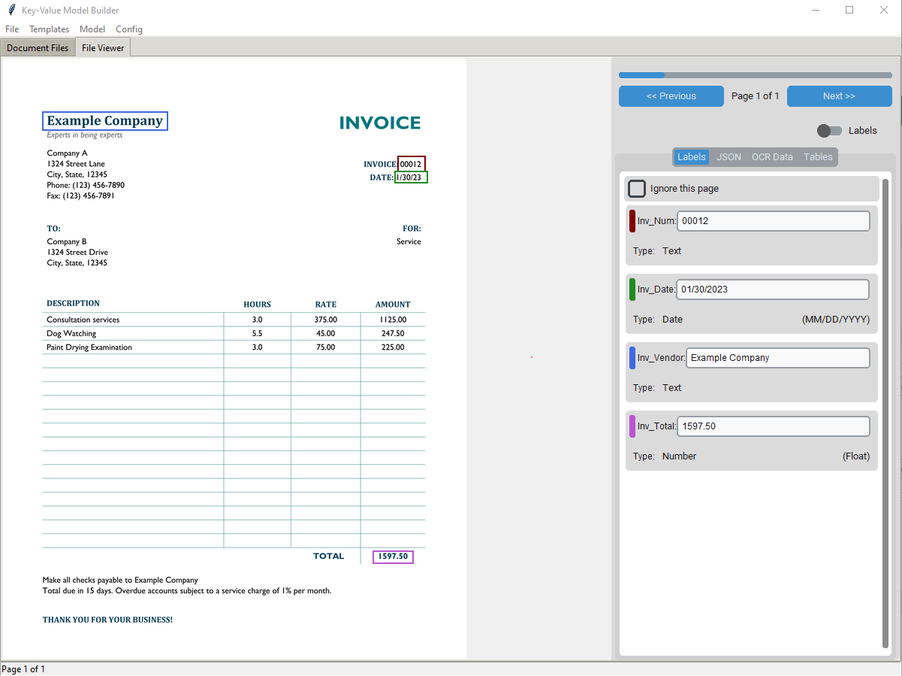

# Quick Zonal OCR Application


Here is a look at the application's graphical user interface:




## Description

This project is a Zonal Optical Character Recognition (OCR) application developed using Python's Tkinter library. It is designed to extract text from specific zones or areas within a document or image, offering a user-friendly interface to define these zones and retrieve text efficiently.

**This is no where close to complete yet. There will be many updates to come. The goal is to create an easy way for users to create document extraction ML models for their own use.**

## Features

- **User-Friendly Interface:** Built with Tkinter.
- **Zone Selection:** Users can select specific areas in a document for text extraction.
- **OCR Functionality:** Utilizes advanced OCR technology to accurately extract text from the selected zones.
- **Document Support:** Compatible with various document and image formats.
- **Real-Time Preview:** Offers a real-time preview of selected zones and extracted text.

## Getting Started

### Prerequisites

- Python >=3.9
- Tkinter

### Installation

1. Clone the repository:
   ```
   git clone https://github.com/ThinkOrFaust/QuickZonalOCR.git
   ```
2. Install required dependencies:
   ```
   pip install -r requirements.txt
   ```

### Usage

1. Run the application:
   ```
   python gui.py
   ```

## How It Works

Details to come soon.

## Contributing

Contributions to improve the application are welcome. Please follow these steps:

1. Fork the repository.
2. Create a new branch (`git checkout -b feature-branch`).
3. Make your changes and commit them (`git commit -am 'Add some feature'`).
4. Push to the branch (`git push origin feature-branch`).
5. Create a new Pull Request.

## License

This project is licensed under the [MIT License](LICENSE) - see the LICENSE file for details.

## Acknowledgments

- PaddleOCR
- CustomTkinter by TomSchimansky
- Tesseract

---
